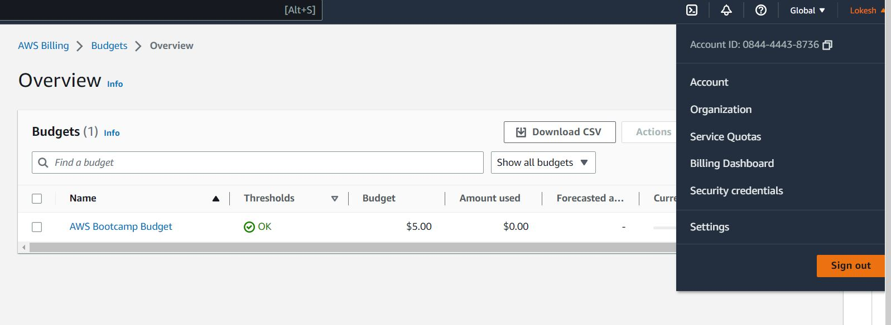
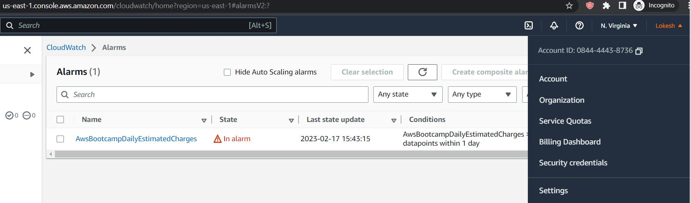
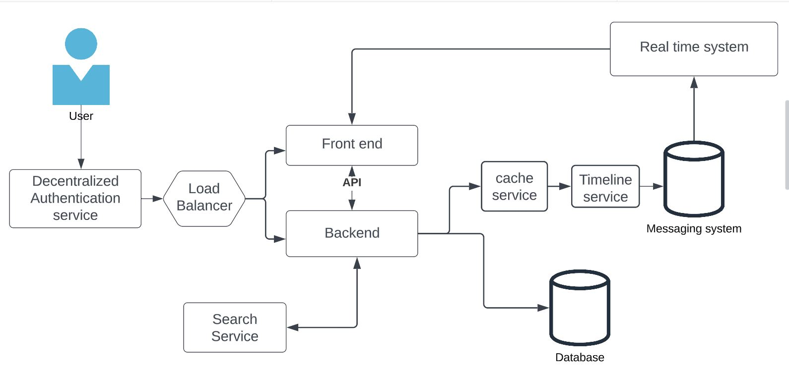
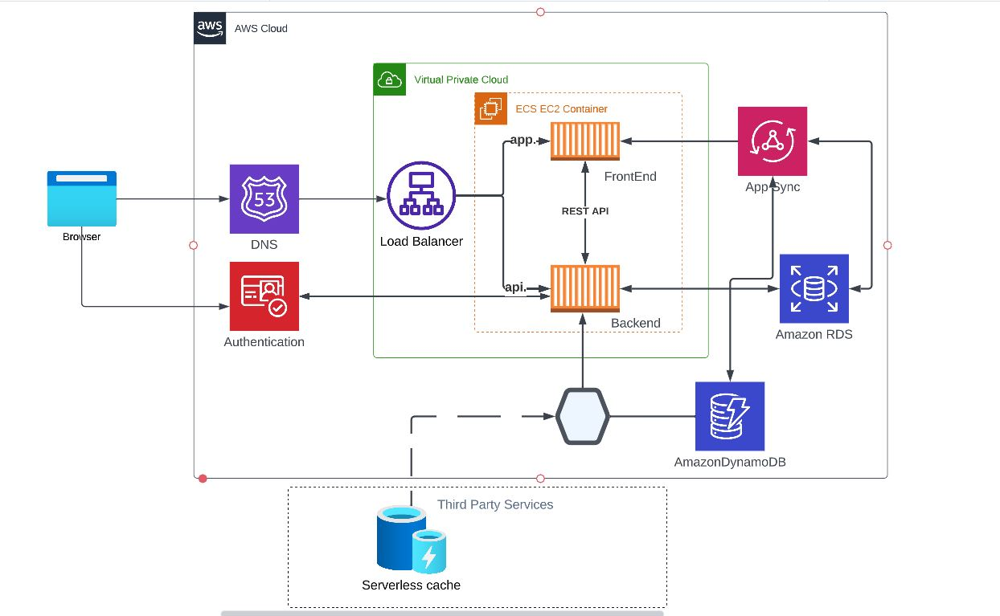

# Week 0 — Billing and Architecture

### Install and Configure AWS CLI
<ol>
  <li>Created IAM user with console and programmatic Access. </li>
  <li>Configured AWS CLI in gitpod workspace</li>
  <li>validated user information with the command aws sts get-caller-identity function and validated account number information</li>
  <li>Please do validate gitpod.yaml.</li>
</ol>

### Create Budget

<ul>
  <li>Created Budget with a limit of 5 USD in AWS. Explored both GUI and CLI method to create the budget.</li>
  <li>Considering the free tier limitaions below budget is configured</li>
  <li>Please do validate the JSON files present in aws/json directory in workspace.</li>
</ul>




### Create Billing Alarm
<ul>
  <li>Created SNS topic using CLI approach.</li>
  <li>Created billing alarm with a limit of 1 USD</li>
</ul>



### Conceptual Design
I created the concpetual design using Lucid based on discussion over live call. As this is fairly new for me trying to get a grasp of things and overview of the project.


[Crudder - Conceptual Design - Lucid Link](https://lucid.app/lucidchart/0d5a2ad3-47bd-48aa-b66c-a6dbcf6e8e76/edit?viewport_loc=72%2C65%2C1239%2C596%2C0_0&invitationId=inv_87798785-a27d-44dd-abd6-e6b2b47b94c6)

### Logical Design
I created the Logical design using Lucid chart for the crudder app.Thank you for your Youtube video for this. It provided more clarity. I provided the basic version now. 
```
To not have any downtime for the application we are developing I will be adding availability Zones concept so that app will be available if one if the aws resgion is down. I am working on it wil provide the updated design shortly. 
```



[Crudder - Logical Design - Lucid Link](https://lucid.app/lucidchart/7499576e-322b-4ee6-ac2a-a6dbf2d18a22/edit?viewport_loc=-2219%2C-781%2C2236%2C1076%2C0_0&invitationId=inv_6adda1da-418c-4afe-9022-f7b4bb3b8b1a)
